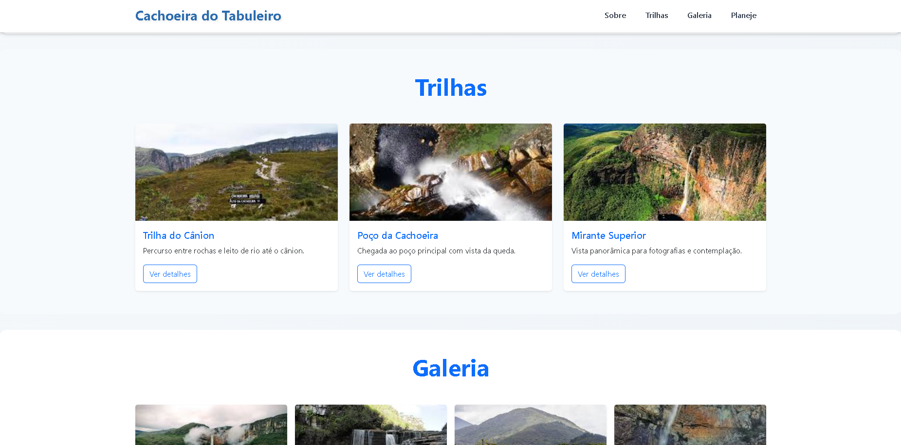
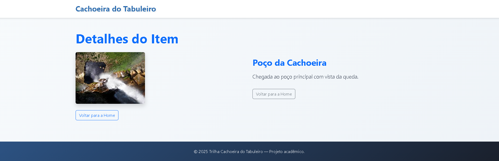

# Trabalho Prático 05 - Semanas 7 e 8

**Páginas de detalhes dinâmicas**

Nessa etapa, vamos evoluir o trabalho anterior, acrescentando a página de detalhes, conforme o  projeto escolhido. Imagine que a página principal (home-page) mostre um visão dos vários itens que existem no seu site. Ao clicar em um item, você é direcionado pra a página de detalhes. A página de detalhe vai mostrar todas as informações sobre o item do seu projeto. seja esse item uma notícia, filme, receita, lugar turístico ou evento.

Leia o enunciado completo no Canvas. 

**IMPORTANTE:** Assim como informado anteriormente, capriche na etapa pois você vai precisar dessa parte para as próximas semanas. 

**IMPORTANTE:** Você deve trabalhar e alterar apenas arquivos dentro da pasta **`public`,** mantendo os arquivos **`index.html`**, **`styles.css`** e **`app.js`** com estes nomes, conforme enunciado. Deixe todos os demais arquivos e pastas desse repositório inalterados. **PRESTE MUITA ATENÇÃO NISSO.**

## Informações Gerais

- Nome: Luan de Assis
- Matricula:
- Proposta de projeto escolhida: Trilha cachoeira de tabuleiro
- Breve descrição sobre seu projeto: Sobre a trilha de tabuleiro.

## Print da Home-Page



## Print da página de detalhes do item



## Cole aqui abaixo a estrutura JSON utilizada no app.js

```javascript
const ITEMS = [
  {
    id: 'trilha-canion',
    title: 'Trilha do Cânion',
    description: 'Percurso entre rochas e leito de rio até o cânion.',
    image: './trilha.jpg'
  },
  {
    id: 'poco-cachoeira',
    title: 'Poço da Cachoeira',
    description: 'Chegada ao poço principal com vista da queda.',
    image: './poço.jpg'
  },
  {
    id: 'mirante-superior',
    title: 'Mirante Superior',
    description: 'Vista panorâmica para fotografias e contemplação.',
    image: './mirante.jpg'
  }
];

```